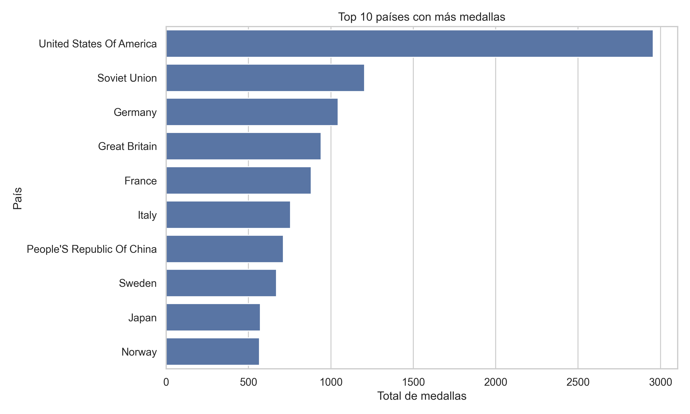
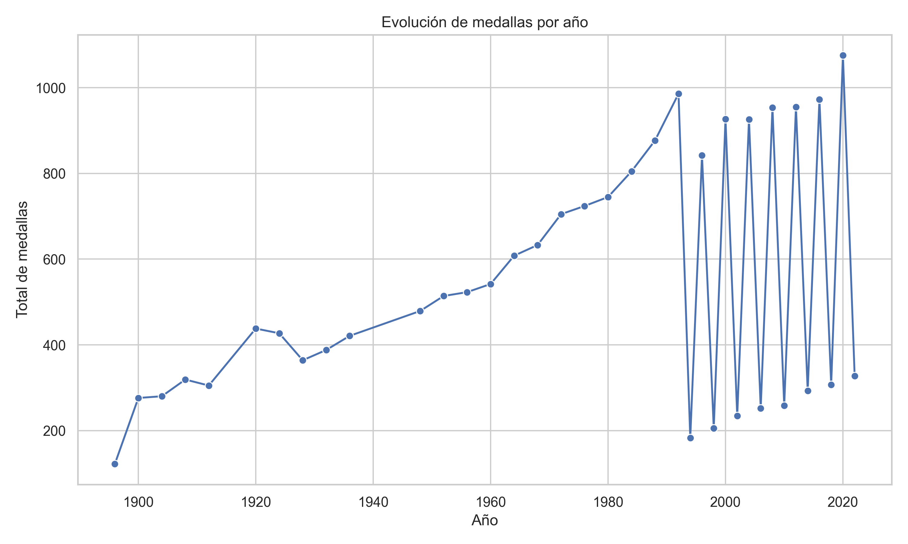
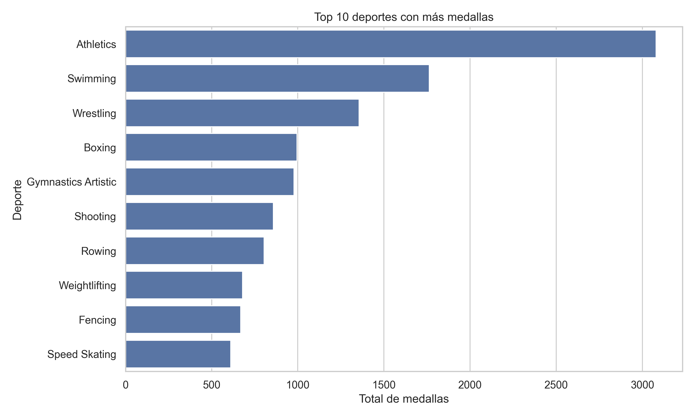

# 🏅 Análisis de Datos – Juegos Olímpicos

## 📌 Descripción del dataset

Este proyecto utiliza un dataset histórico de los Juegos Olímpicos que contiene información sobre atletas, países, disciplinas deportivas y medallas obtenidas a lo largo de diferentes ediciones.

El dataset incluye variables como:

* Año (`year`)
* País (`country_name`)
* Disciplina (`discipline_title`)
* Tipo de participante (`participant_type`)
* Tipo de medalla (`medal_type`)
* Total de medallas (`total_medals`)

---

## 🎯 Objetivo del proyecto

Analizar el comportamiento de los Juegos Olímpicos a través del tiempo, identificando patrones relevantes como:

* Países con mayor cantidad de medallas
* Evolución de medallas por año
* Participación de atletas y equipos
* Deportes con mayor cantidad de medallas

---

## 🧹 Limpieza y transformación de datos

Se realizó un proceso de limpieza que incluyó:

* Eliminación de valores nulos
* Revisión de tipos de datos
* Eliminación de duplicados
* Creación de nuevas variables como:

  * Total de medallas
  * Indicador de medalla (`has_medal`)
* Organización del dataset final en:

```
data/processed/olympics_clean.csv
```

---

## 📊 Análisis y visualización

### 🥇 Top 10 países con más medallas

Se identificaron los países con mayor número de medallas acumuladas en la historia de los Juegos Olímpicos.



---

### 📈 Evolución de medallas por año

Se analizó cómo ha cambiado la cantidad de medallas a lo largo del tiempo.




---

### 🏆 Deportes con mayor número de medallas

Se identificaron los deportes que han acumulado más medallas en la historia (Top 10).



---

## 🔍 Hallazgos principales

* Algunos países dominan históricamente el medallero olímpico.
* La cantidad de medallas ha aumentado con el paso del tiempo.
* La participación individual es mayor que la participación en equipo.
* Deportes como atletismo y natación concentran la mayor cantidad de medallas.

---

## 📌 Conclusiones

El análisis permite identificar tendencias importantes en los Juegos Olímpicos, destacando la evolución del evento y la concentración de medallas en ciertos países y disciplinas.

A pesar de las limitaciones, el dataset ofrece información valiosa para comprender el comportamiento histórico del deporte olímpico.

---

## 👨‍💻 Tecnologías utilizadas

* Python
* Pandas
* Matplotlib
* Seaborn
* Jupyter Notebook / VS Code

---

## 📁 Estructura del proyecto

```
data/
 ├── raw/
 └── processed/
      └── olympics_clean.csv

notebooks/
 ├── 01_cleaning.ipynb
 ├── 02_eda.ipynb
 └── 03_visualization.ipynb

images/
 ├── top10_paises_medallas.png
 ├── evolucion_medallas_anio.png
 └── top10_deportes_medallas.png
```

## Extensión del proyecto: estimación del desempeño futuro
### ¿Cómo rediseñarían el proyecto para estimar el desempeño futuro de un país en los Juegos Olímpicos, considerando factores externos que no están en el dataset?

Para rediseñar el proyecto con el objetivo de estimar el desempeño futuro de un país en los Juegos Olímpicos, sería necesario ampliar el enfoque actual incorporando factores externos que no están presentes en el dataset original. El análisis histórico de medallas es un buen punto de partida, pero por sí solo no captura todas las variables que influyen en el rendimiento deportivo.

Una primera mejora consistiría en integrar datos socioeconómicos por país, como inversión pública en deporte, Producto Interno Bruto, población, nivel de desarrollo o presupuesto destinado a los comités olímpicos nacionales. Estos datos permitirían contextualizar el desempeño deportivo dentro de la capacidad estructural de cada país. Asimismo, se podrían incorporar variables relacionadas con la localía, ya que los países anfitriones suelen mostrar un mejor rendimiento, así como factores políticos o históricos como boicots, conflictos o ausencias en determinadas ediciones.

Otra extensión relevante sería añadir información demográfica y deportiva, como número de atletas participantes por país, edad promedio del equipo, experiencia previa o tendencia de crecimiento en ediciones recientes. Con estas variables, se podría construir un modelo predictivo utilizando técnicas de aprendizaje automático, como regresión, árboles de decisión o modelos de clasificación, que permita estimar rangos probables de medallas futuras.

Finalmente, para asegurar la confiabilidad de las predicciones, sería fundamental validar los modelos con datos históricos y evitar un impacto negativo en la interpretación, manteniendo un enfoque estadístico explicable. De esta manera, el proyecto pasaría de un análisis descriptivo a un sistema predictivo con valor estratégico.
